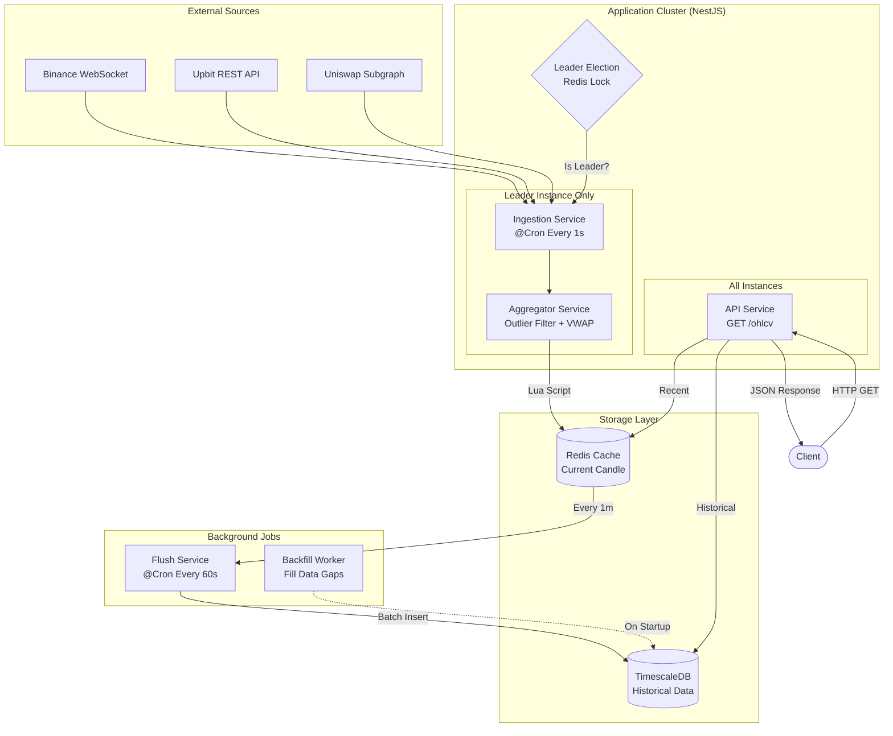

# 🏗️ Token Price Oracle - Architecture Design Document

## 📋 Table of Contents
- [1. Overview](#1-overview)
- [2. Architecture Analysis](#2-architecture-analysis)
- [3. System Architecture](#3-system-architecture)
- [4. Database Design](#4-database-design)
- [5. Redis Data Structures](#5-redis-data-structures)
- [6. Core Module Implementation](#6-core-module-implementation)
- [7. API Design](#7-api-design)
- [8. Testing Strategy](#8-testing-strategy)
- [9. Operational Considerations](#9-operational-considerations)
- [10. Deployment & Configuration](#10-deployment--configuration)

---

## 1. Overview

### 1.1 Purpose
A distributed system that collects cryptocurrency price data from multiple exchanges (CEX/DEX), aggregates them using statistical algorithms (VWAP/Median), and provides reliable OHLCV time-series data through a public API.

### 1.2 Core Objectives
- **Data Integrity**: Outlier removal and weighted averaging for reliable price computation
- **High Availability**: Redis-based distributed locking for leader election preventing duplicate execution
- **Performance**: Redis (Hot) + TimescaleDB (Cold) architecture for optimized write throughput and query speed
- **Observability**: Comprehensive logging, metrics, and monitoring
- **Testability**: >80% code coverage with unit, integration, and E2E tests

### 1.3 Key Requirements
- **Latency**: Price updates within 1 second, API response < 100ms (p95)
- **Accuracy**: Multi-source aggregation with outlier detection
- **Scalability**: Support 100+ trading pairs, 10+ exchanges
- **Reliability**: 99.9% uptime, automatic failover within 10 seconds

---

## 2. Architecture Analysis

### 2.1 ✅ Strengths of Original Design

1. **Hot/Cold Storage Pattern**: Redis for real-time data + TimescaleDB for historical data is proven architecture
2. **Leader Election**: Prevents duplicate data ingestion across multiple instances
3. **Continuous Aggregates**: TimescaleDB's native feature efficiently generates higher timeframes (5m, 1h, etc.)
4. **Batch Processing**: Reduces database write load by flushing every minute
5. **Circuit Breaker**: Mentioned for external API fault tolerance

### 2.2 ⚠️ Critical Issues & Improvements

#### Issue 1: Data Loss Risk During Flush
**Problem**: Original design deletes Redis keys before confirming DB write success
```typescript
// ❌ Dangerous: Data loss if DB write fails
pipeline.hgetall(key);
pipeline.del(key);  // Deleted BEFORE DB write confirmed!
```

**Solution**: Two-phase commit pattern
```typescript
// ✅ Safe: Only delete after successful persistence
const data = await redis.hgetall(key);
await db.save(data);  // Wait for DB confirmation
await redis.del(key);  // Then delete
```

**Better Solution**: Use a processed timestamp marker instead of deletion
```typescript
// Mark as processed instead of deleting
await redis.hset(key, 'flushed_at', Date.now());
await redis.expire(key, 3600); // Keep for 1 hour as backup
```

#### Issue 2: Leader Election Vulnerabilities

**Problem**: 10s TTL + 5s heartbeat is too aggressive, may cause split-brain
- Network hiccup for >5s → Leader loses lock
- New leader starts → Duplicate data ingestion
- Race condition during leadership transition

**Solution**: Fencing tokens + grace period
```typescript
class ImprovedLeaderService {
  private fencingToken = 0;

  async acquireLock(): Promise<number | null> {
    const token = Date.now();
    const result = await redis.set(
      LOCK_KEY,
      JSON.stringify({ id: this.MY_ID, token }),
      'EX', 30,  // Longer TTL: 30s
      'NX'
    );
    if (result === 'OK') {
      this.fencingToken = token;
      return token;
    }
    return null;
  }

  async executeWithFencing(token: number, fn: Function) {
    // Verify token before critical operations
    const current = await redis.get(LOCK_KEY);
    if (!current || JSON.parse(current).token !== token) {
      throw new Error('Fencing token mismatch - lost leadership');
    }
    return fn();
  }
}
```

#### Issue 3: Missing Atomic Redis Operations

**Problem**: HGETALL + HMSET is not atomic → race conditions

**Solution**: Lua scripts for atomicity
```lua
-- update_candle.lua
local key = KEYS[1]
local price = tonumber(ARGV[1])
local now = tonumber(ARGV[2])

local current = redis.call('HGETALL', key)
if #current == 0 then
  redis.call('HMSET', key, 'o', price, 'h', price, 'l', price, 'c', price, 't', now, 'v', 0)
else
  local h = redis.call('HGET', key, 'h')
  local l = redis.call('HGET', key, 'l')
  redis.call('HMSET', key,
    'h', math.max(tonumber(h), price),
    'l', math.min(tonumber(l), price),
    'c', price
  )
end
return 1
```

#### Issue 4: No Outlier Detection Implementation

**Problem**: "이상치 제거" mentioned but no algorithm specified

**Solution**: IQR (Interquartile Range) method
```typescript
filterOutliers(prices: number[]): number[] {
  if (prices.length < 4) return prices;

  const sorted = [...prices].sort((a, b) => a - b);
  const q1 = sorted[Math.floor(sorted.length * 0.25)];
  const q3 = sorted[Math.floor(sorted.length * 0.75)];
  const iqr = q3 - q1;

  const lower = q1 - 1.5 * iqr;
  const upper = q3 + 1.5 * iqr;

  return prices.filter(p => p >= lower && p <= upper);
}
```

#### Issue 5: No Index Strategy

**Solution**: Add proper indexes
```sql
-- Primary query pattern: symbol + time range
CREATE INDEX idx_ohlcv_1m_symbol_time ON ohlcv_1m (symbol, time DESC);

-- For aggregation queries
CREATE INDEX idx_ohlcv_1m_time_symbol ON ohlcv_1m (time DESC, symbol);

-- Partial index for recent data (hot queries)
CREATE INDEX idx_ohlcv_recent ON ohlcv_1m (symbol, time DESC)
  WHERE time > NOW() - INTERVAL '7 days';
```

#### Issue 6: No Monitoring/Observability

**Solution**: Add Prometheus metrics + Structured logging
```typescript
@Injectable()
export class MetricsService {
  private readonly priceUpdateCounter = new Counter({
    name: 'oracle_price_updates_total',
    help: 'Total price updates',
    labelNames: ['symbol', 'source']
  });

  private readonly aggregationLatency = new Histogram({
    name: 'oracle_aggregation_duration_seconds',
    help: 'Price aggregation latency',
    buckets: [0.01, 0.05, 0.1, 0.5, 1, 2]
  });

  private readonly dbFlushLatency = new Histogram({
    name: 'oracle_db_flush_duration_seconds',
    help: 'Database flush latency',
    buckets: [0.1, 0.5, 1, 2, 5, 10]
  });
}
```

### 2.3 🎯 Additional Recommendations

1. **Dead Letter Queue (DLQ)**: For failed price updates that need manual inspection
2. **Rate Limiting**: Protect external APIs and prevent abuse of public endpoints
3. **API Versioning**: `/api/v1/` prefix for future-proofing
4. **Schema Validation**: Use Zod/Joi for runtime type safety
5. **Graceful Degradation**: Return cached data if DB is down
6. **Backfill Worker**: Separate service to fill historical gaps
7. **WebSocket Support**: Real-time price streaming for clients
8. **Multi-Region**: Active-passive setup for disaster recovery

---

## 3. System Architecture

### 3.1 Tech Stack

| Component | Technology | Version | Purpose |
|-----------|-----------|---------|---------|
| Runtime | Node.js | 20.x LTS | Server runtime |
| Language | TypeScript | 5.3+ | Type safety |
| Framework | NestJS | 10.x | Modular architecture |
| Database | PostgreSQL + TimescaleDB | 15+ / 2.13+ | Time-series storage |
| Cache | Redis | 7.x | Hot storage + locking |
| ORM | TypeORM | 0.3.x | Database abstraction |
| Validation | Zod | 3.x | Schema validation |
| Precision Math | big.js | 6.x | Financial calculations |
| Exchange Integration | ccxt | 4.x | Unified exchange API |
| HTTP Client | axios | 1.x | External API calls |
| Testing | Jest + Supertest | 29.x | Unit + E2E tests |
| Monitoring | Prometheus + Grafana | - | Metrics & dashboards |
| Logging | Winston + Pino | - | Structured logging |

### 3.2 Data Pipeline Flow



### 3.3 Module Dependency Graph

```
AppModule
├── CommonModule (Global)
│   ├── LeaderService
│   ├── MetricsService
│   └── LoggerService
├── ConfigModule (@nestjs/config)
├── RedisModule (ioredis)
├── DatabaseModule (TypeORM)
├── IngestionModule
│   ├── ExchangeModule
│   │   ├── BinanceService
│   │   ├── UpbitService
│   │   └── UniswapService
│   ├── AggregatorService
│   └── IngestionService
├── StorageModule
│   ├── FlushService
│   └── BackfillService
└── ApiModule
    ├── MarketController
    └── HealthController
```

---

## 4. Database Design

### 4.1 TimescaleDB Schema

```sql
-- Enable TimescaleDB extension
CREATE EXTENSION IF NOT EXISTS timescaledb;

-- 1-minute base table (hypertable)
CREATE TABLE ohlcv_1m (
    time        TIMESTAMPTZ       NOT NULL,
    symbol      TEXT              NOT NULL,
    open        NUMERIC(20, 8)    NOT NULL,  -- Use NUMERIC for precision
    high        NUMERIC(20, 8)    NOT NULL,
    low         NUMERIC(20, 8)    NOT NULL,
    close       NUMERIC(20, 8)    NOT NULL,
    volume      NUMERIC(30, 8)    DEFAULT 0,
    quote_volume NUMERIC(30, 8)   DEFAULT 0,  -- USDT volume
    source_count INT              DEFAULT 0,  -- Number of exchanges used
    sources     TEXT[]            DEFAULT '{}', -- Exchange names
    metadata    JSONB             DEFAULT '{}', -- Extensible metadata
    PRIMARY KEY (time, symbol)
);

-- Convert to hypertable (1 week chunks)
SELECT create_hypertable('ohlcv_1m', 'time',
  chunk_time_interval => INTERVAL '1 week',
  if_not_exists => TRUE
);

-- Compression policy (compress data older than 7 days)
ALTER TABLE ohlcv_1m SET (
  timescaledb.compress,
  timescaledb.compress_segmentby = 'symbol',
  timescaledb.compress_orderby = 'time DESC'
);

SELECT add_compression_policy('ohlcv_1m', INTERVAL '7 days');

-- Retention policy (drop data older than 2 years)
SELECT add_retention_policy('ohlcv_1m', INTERVAL '2 years');

-- Indexes
CREATE INDEX idx_ohlcv_1m_symbol_time ON ohlcv_1m (symbol, time DESC);
CREATE INDEX idx_ohlcv_1m_time ON ohlcv_1m (time DESC) WHERE time > NOW() - INTERVAL '7 days';

-- 5-minute continuous aggregate
CREATE MATERIALIZED VIEW ohlcv_5m
WITH (timescaledb.continuous) AS
SELECT
    time_bucket('5 minutes', time) AS bucket,
    symbol,
    FIRST(open, time) AS open,
    MAX(high) AS high,
    MIN(low) AS low,
    LAST(close, time) AS close,
    SUM(volume) AS volume,
    SUM(quote_volume) AS quote_volume,
    AVG(source_count) AS avg_source_count
FROM ohlcv_1m
GROUP BY bucket, symbol
WITH NO DATA;

-- Refresh policy (update every 1 minute)
SELECT add_continuous_aggregate_policy('ohlcv_5m',
    start_offset => INTERVAL '10 minutes',
    end_offset => INTERVAL '1 minute',
    schedule_interval => INTERVAL '1 minute'
);

-- 1-hour continuous aggregate
CREATE MATERIALIZED VIEW ohlcv_1h
WITH (timescaledb.continuous) AS
SELECT
    time_bucket('1 hour', time) AS bucket,
    symbol,
    FIRST(open, time) AS open,
    MAX(high) AS high,
    MIN(low) AS low,
    LAST(close, time) AS close,
    SUM(volume) AS volume,
    SUM(quote_volume) AS quote_volume,
    AVG(source_count) AS avg_source_count
FROM ohlcv_1m
GROUP BY bucket, symbol
WITH NO DATA;

SELECT add_continuous_aggregate_policy('ohlcv_1h',
    start_offset => INTERVAL '3 hours',
    end_offset => INTERVAL '1 hour',
    schedule_interval => INTERVAL '1 hour'
);

-- 1-day continuous aggregate
CREATE MATERIALIZED VIEW ohlcv_1d
WITH (timescaledb.continuous) AS
SELECT
    time_bucket('1 day', time) AS bucket,
    symbol,
    FIRST(open, time) AS open,
    MAX(high) AS high,
    MIN(low) AS low,
    LAST(close, time) AS close,
    SUM(volume) AS volume,
    SUM(quote_volume) AS quote_volume,
    AVG(source_count) AS avg_source_count
FROM ohlcv_1m
GROUP BY bucket, symbol
WITH NO DATA;

SELECT add_continuous_aggregate_policy('ohlcv_1d',
    start_offset => INTERVAL '3 days',
    end_offset => INTERVAL '1 day',
    schedule_interval => INTERVAL '1 hour'
);
```

### 4.2 Supporting Tables

```sql
-- Exchange health tracking
CREATE TABLE exchange_health (
    exchange    TEXT             NOT NULL,
    symbol      TEXT             NOT NULL,
    timestamp   TIMESTAMPTZ      NOT NULL DEFAULT NOW(),
    status      TEXT             NOT NULL, -- 'healthy', 'degraded', 'down'
    latency_ms  INT,
    error_rate  NUMERIC(5, 2),   -- Percentage
    last_error  TEXT,
    PRIMARY KEY (exchange, symbol, timestamp)
);

SELECT create_hypertable('exchange_health', 'timestamp', if_not_exists => TRUE);
SELECT add_retention_policy('exchange_health', INTERVAL '30 days');

-- Data quality metrics
CREATE TABLE data_quality_log (
    timestamp       TIMESTAMPTZ NOT NULL DEFAULT NOW(),
    symbol          TEXT        NOT NULL,
    total_sources   INT         NOT NULL,
    valid_sources   INT         NOT NULL,
    outliers_removed INT        DEFAULT 0,
    price_variance  NUMERIC(10, 4),
    algorithm       TEXT,       -- 'median', 'vwap', etc.
    PRIMARY KEY (timestamp, symbol)
);

SELECT create_hypertable('data_quality_log', 'timestamp', if_not_exists => TRUE);
SELECT add_retention_policy('data_quality_log', INTERVAL '90 days');
```

---

## 5. Redis Data Structures

### 5.1 Leader Election

```
Key: oracle:leader:election
Type: String
Value: {"instanceId": "srv-seoul-01", "token": 1701234567890, "startedAt": "2024-01-01T00:00:00Z"}
TTL: 30 seconds
```

### 5.2 Current Candle (Hot Storage)

```
Key Pattern: oracle:candle:{symbol}:current
Type: Hash
Fields:
  - o: Open price (string, high precision)
  - h: High price
  - l: Low price
  - c: Close price (last)
  - v: Volume (base currency)
  - qv: Quote volume (USDT)
  - t: Bucket start time (Unix timestamp in milliseconds)
  - sc: Source count
  - s: Source list (comma-separated)
TTL: 3600 seconds (kept as backup after flush)
```

### 5.3 Exchange Circuit Breaker

```
Key Pattern: oracle:circuit:{exchange}:{symbol}
Type: String
Value: {"state": "OPEN", "failures": 15, "lastFailure": 1701234567890}
TTL: 60 seconds (auto-reset)
```

### 5.4 Rate Limiting (API)

```
Key Pattern: oracle:ratelimit:{ip}:{endpoint}
Type: String
Value: Request count
TTL: 60 seconds
Limit: 100 requests/minute
```

### 5.5 Distributed Lock for Flush

```
Key: oracle:lock:flush
Type: String
Value: Instance ID
TTL: 10 seconds
Purpose: Prevent concurrent flush operations
```

### 5.6 Last Flush Timestamp

```
Key Pattern: oracle:flush:last:{symbol}
Type: String
Value: Unix timestamp (milliseconds)
TTL: 86400 seconds (1 day)
Purpose: Gap detection for backfill
```

---

## 6. Core Module Implementation

### 6.1 Leader Election Module

```typescript
// src/common/leader/leader.service.ts
import { Injectable, Logger, OnModuleDestroy } from '@nestjs/common';
import { InjectRedis } from '@nestjs-modules/ioredis';
import Redis from 'ioredis';
import { v4 as uuidv4 } from 'uuid';

export interface LeaderInfo {
  instanceId: string;
  token: number;
  startedAt: string;
}

@Injectable()
export class LeaderService implements OnModuleDestroy {
  private readonly logger = new Logger(LeaderService.name);
  private readonly LOCK_KEY = 'oracle:leader:election';
  private readonly LOCK_TTL = 30; // seconds
  private readonly HEARTBEAT_INTERVAL = 10; // seconds
  private readonly instanceId = uuidv4();
  private currentToken: number | null = null;
  private heartbeatTimer?: NodeJS.Timeout;

  constructor(@InjectRedis() private readonly redis: Redis) {}

  async start(): Promise<void> {
    this.heartbeatTimer = setInterval(() => {
      this.tryAcquireLock().catch(err => {
        this.logger.error(`Heartbeat failed: ${err.message}`);
      });
    }, this.HEARTBEAT_INTERVAL * 1000);

    await this.tryAcquireLock();
  }

  async isLeader(): Promise<boolean> {
    if (!this.currentToken) return false;

    const current = await this.redis.get(this.LOCK_KEY);
    if (!current) return false;

    try {
      const leader: LeaderInfo = JSON.parse(current);
      return leader.instanceId === this.instanceId && leader.token === this.currentToken;
    } catch {
      return false;
    }
  }

  async getLeaderInfo(): Promise<LeaderInfo | null> {
    const current = await this.redis.get(this.LOCK_KEY);
    if (!current) return null;
    return JSON.parse(current);
  }

  private async tryAcquireLock(): Promise<void> {
    const token = Date.now();
    const leaderInfo: LeaderInfo = {
      instanceId: this.instanceId,
      token,
      startedAt: new Date().toISOString(),
    };

    const result = await this.redis.set(
      this.LOCK_KEY,
      JSON.stringify(leaderInfo),
      'EX',
      this.LOCK_TTL,
      'NX',
    );

    if (result === 'OK') {
      if (!this.currentToken) {
        this.logger.log(`🎖️  Became leader with token ${token}`);
      }
      this.currentToken = token;
      return;
    }

    // Check if we're already the leader and just renew
    const current = await this.redis.get(this.LOCK_KEY);
    if (current) {
      const leader: LeaderInfo = JSON.parse(current);
      if (leader.instanceId === this.instanceId) {
        // Renew our lock
        await this.redis.set(
          this.LOCK_KEY,
          JSON.stringify({ ...leader, token }),
          'EX',
          this.LOCK_TTL,
        );
        this.currentToken = token;
        return;
      }
    }

    // Not leader
    if (this.currentToken) {
      this.logger.warn(`❌ Lost leadership`);
      this.currentToken = null;
    }
  }

  async onModuleDestroy(): Promise<void> {
    if (this.heartbeatTimer) {
      clearInterval(this.heartbeatTimer);
    }

    // Release lock if we're the leader
    if (this.currentToken) {
      const current = await this.redis.get(this.LOCK_KEY);
      if (current) {
        const leader: LeaderInfo = JSON.parse(current);
        if (leader.instanceId === this.instanceId) {
          await this.redis.del(this.LOCK_KEY);
          this.logger.log('Released leadership lock gracefully');
        }
      }
    }
  }
}
```

```typescript
// src/common/decorators/leader-only.decorator.ts
import { SetMetadata } from '@nestjs/common';

export const LEADER_ONLY_KEY = 'leaderOnly';
export const LeaderOnly = () => SetMetadata(LEADER_ONLY_KEY, true);

// Interceptor to enforce leader-only execution
import { Injectable, NestInterceptor, ExecutionContext, CallHandler } from '@nestjs/common';
import { Reflector } from '@nestjs/core';
import { Observable, EMPTY } from 'rxjs';
import { LeaderService } from './leader.service';

@Injectable()
export class LeaderOnlyInterceptor implements NestInterceptor {
  constructor(
    private readonly reflector: Reflector,
    private readonly leaderService: LeaderService,
  ) {}

  async intercept(context: ExecutionContext, next: CallHandler): Promise<Observable<any>> {
    const isLeaderOnly = this.reflector.get<boolean>(LEADER_ONLY_KEY, context.getHandler());

    if (!isLeaderOnly) {
      return next.handle();
    }

    const isLeader = await this.leaderService.isLeader();
    if (!isLeader) {
      // Silently skip execution for non-leaders
      return EMPTY;
    }

    return next.handle();
  }
}
```

### 6.2 Exchange Integration Module

```typescript
// src/ingestion/exchanges/base-exchange.service.ts
import { Logger } from '@nestjs/common';
import { CircuitBreaker } from './circuit-breaker';

export interface PriceData {
  exchange: string;
  symbol: string;
  price: number;
  volume: number;
  quoteVolume: number;
  timestamp: number;
}

export abstract class BaseExchangeService {
  protected readonly logger: Logger;
  protected readonly circuitBreaker: CircuitBreaker;

  constructor(exchangeName: string) {
    this.logger = new Logger(`${exchangeName}Exchange`);
    this.circuitBreaker = new CircuitBreaker({
      failureThreshold: 5,
      resetTimeout: 60000, // 1 minute
      monitoringPeriod: 30000, // 30 seconds
    });
  }

  abstract fetchPrice(symbol: string): Promise<PriceData>;

  async fetchPriceWithCircuitBreaker(symbol: string): Promise<PriceData | null> {
    try {
      return await this.circuitBreaker.execute(() => this.fetchPrice(symbol));
    } catch (error) {
      this.logger.warn(`Circuit breaker OPEN for ${symbol}: ${error.message}`);
      return null;
    }
  }
}
```

```typescript
// src/ingestion/exchanges/binance.service.ts
import { Injectable } from '@nestjs/common';
import { BaseExchangeService, PriceData } from './base-exchange.service';
import axios from 'axios';

@Injectable()
export class BinanceService extends BaseExchangeService {
  private readonly API_BASE = 'https://api.binance.com';

  constructor() {
    super('Binance');
  }

  async fetchPrice(symbol: string): Promise<PriceData> {
    const normalizedSymbol = symbol.replace('/', ''); // BTC/USDT -> BTCUSDT

    const response = await axios.get(`${this.API_BASE}/api/v3/ticker/24hr`, {
      params: { symbol: normalizedSymbol },
      timeout: 5000,
    });

    const data = response.data;

    return {
      exchange: 'binance',
      symbol,
      price: parseFloat(data.lastPrice),
      volume: parseFloat(data.volume),
      quoteVolume: parseFloat(data.quoteVolume),
      timestamp: data.closeTime,
    };
  }
}
```

### 6.3 Aggregation Service

```typescript
// src/ingestion/aggregation.service.ts
import { Injectable, Logger } from '@nestjs/common';
import { PriceData } from './exchanges/base-exchange.service';
import Big from 'big.js';

export interface AggregatedPrice {
  symbol: string;
  price: number;
  volume: number;
  quoteVolume: number;
  sourceCount: number;
  sources: string[];
  algorithm: 'median' | 'vwap';
  variance: number;
  outliersRemoved: number;
}

@Injectable()
export class AggregationService {
  private readonly logger = new Logger(AggregationService.name);

  /**
   * Remove outliers using IQR (Interquartile Range) method
   */
  private filterOutliers(prices: PriceData[]): { valid: PriceData[]; removed: number } {
    if (prices.length < 4) {
      return { valid: prices, removed: 0 };
    }

    const values = prices.map(p => p.price).sort((a, b) => a - b);
    const q1 = values[Math.floor(values.length * 0.25)];
    const q3 = values[Math.floor(values.length * 0.75)];
    const iqr = q3 - q1;

    const lowerBound = q1 - 1.5 * iqr;
    const upperBound = q3 + 1.5 * iqr;

    const valid = prices.filter(p => p.price >= lowerBound && p.price <= upperBound);

    if (valid.length < prices.length) {
      this.logger.debug(
        `Removed ${prices.length - valid.length} outliers for ${prices[0]?.symbol}. ` +
        `Bounds: [${lowerBound.toFixed(2)}, ${upperBound.toFixed(2)}]`
      );
    }

    return { valid, removed: prices.length - valid.length };
  }

  /**
   * Calculate median price
   */
  private calculateMedian(prices: PriceData[]): number {
    const sorted = prices.map(p => p.price).sort((a, b) => a - b);
    const mid = Math.floor(sorted.length / 2);

    if (sorted.length % 2 === 0) {
      return (sorted[mid - 1] + sorted[mid]) / 2;
    }
    return sorted[mid];
  }

  /**
   * Calculate Volume-Weighted Average Price (VWAP)
   */
  private calculateVWAP(prices: PriceData[]): number {
    let totalVolume = new Big(0);
    let weightedSum = new Big(0);

    for (const data of prices) {
      const vol = new Big(data.quoteVolume || data.volume);
      if (vol.gt(0)) {
        totalVolume = totalVolume.plus(vol);
        weightedSum = weightedSum.plus(vol.times(data.price));
      }
    }

    if (totalVolume.eq(0)) {
      return this.calculateMedian(prices);
    }

    return weightedSum.div(totalVolume).toNumber();
  }

  /**
   * Calculate price variance (for quality metrics)
   */
  private calculateVariance(prices: number[]): number {
    const mean = prices.reduce((a, b) => a + b, 0) / prices.length;
    const variance = prices.reduce((sum, p) => sum + Math.pow(p - mean, 2), 0) / prices.length;
    return Math.sqrt(variance); // Standard deviation
  }

  /**
   * Aggregate multiple price sources into a single reliable price
   */
  aggregate(rawPrices: PriceData[]): AggregatedPrice | null {
    if (rawPrices.length === 0) {
      return null;
    }

    const symbol = rawPrices[0].symbol;

    // 1. Remove outliers
    const { valid: validPrices, removed: outliersRemoved } = this.filterOutliers(rawPrices);

    if (validPrices.length === 0) {
      this.logger.warn(`All prices filtered out as outliers for ${symbol}`);
      return null;
    }

    // 2. Choose algorithm based on data availability
    const hasVolume = validPrices.some(p => (p.quoteVolume || p.volume) > 0);
    const algorithm = hasVolume ? 'vwap' : 'median';

    // 3. Calculate aggregated price
    const price = algorithm === 'vwap'
      ? this.calculateVWAP(validPrices)
      : this.calculateMedian(validPrices);

    // 4. Calculate totals
    const totalVolume = validPrices.reduce((sum, p) => sum + (p.volume || 0), 0);
    const totalQuoteVolume = validPrices.reduce((sum, p) => sum + (p.quoteVolume || 0), 0);

    // 5. Calculate quality metrics
    const variance = this.calculateVariance(validPrices.map(p => p.price));

    return {
      symbol,
      price,
      volume: totalVolume,
      quoteVolume: totalQuoteVolume,
      sourceCount: validPrices.length,
      sources: validPrices.map(p => p.exchange),
      algorithm,
      variance,
      outliersRemoved,
    };
  }
}
```

### 6.4 Ingestion Service (Leader-Only)

```typescript
// src/ingestion/ingestion.service.ts
import { Injectable, Logger, OnModuleInit } from '@nestjs/common';
import { Cron, CronExpression } from '@nestjs/schedule';
import { InjectRedis } from '@nestjs-modules/ioredis';
import Redis from 'ioredis';
import { LeaderService } from '../common/leader/leader.service';
import { LeaderOnly } from '../common/decorators/leader-only.decorator';
import { BinanceService } from './exchanges/binance.service';
import { UpbitService } from './exchanges/upbit.service';
import { AggregationService } from './aggregation.service';
import { MetricsService } from '../common/metrics/metrics.service';
import { ConfigService } from '@nestjs/config';
import * as fs from 'fs';
import * as path from 'path';

@Injectable()
export class IngestionService implements OnModuleInit {
  private readonly logger = new Logger(IngestionService.name);
  private updateCandleSha: string;
  private symbols: string[];

  constructor(
    @InjectRedis() private readonly redis: Redis,
    private readonly leaderService: LeaderService,
    private readonly binance: BinanceService,
    private readonly upbit: UpbitService,
    private readonly aggregator: AggregationService,
    private readonly metrics: MetricsService,
    private readonly config: ConfigService,
  ) {
    this.symbols = this.config.get<string[]>('SYMBOLS', ['BTC/USDT', 'ETH/USDT']);
  }

  async onModuleInit() {
    // Load Lua script for atomic candle updates
    const scriptPath = path.join(__dirname, '../../scripts/update_candle.lua');
    const script = fs.readFileSync(scriptPath, 'utf8');
    this.updateCandleSha = await this.redis.script('LOAD', script);
    this.logger.log(`Loaded Lua script: ${this.updateCandleSha}`);
  }

  @Cron(CronExpression.EVERY_SECOND)
  @LeaderOnly()
  async collectPrices(): Promise<void> {
    const startTime = Date.now();

    for (const symbol of this.symbols) {
      try {
        // 1. Fetch from multiple exchanges in parallel
        const rawPrices = await Promise.all([
          this.binance.fetchPriceWithCircuitBreaker(symbol),
          this.upbit.fetchPriceWithCircuitBreaker(symbol),
          // Add more exchanges here
        ]);

        // 2. Filter out failed fetches
        const validPrices = rawPrices.filter(p => p !== null);

        if (validPrices.length === 0) {
          this.logger.warn(`No valid prices for ${symbol}`);
          continue;
        }

        // 3. Aggregate
        const aggregated = this.aggregator.aggregate(validPrices);
        if (!aggregated) {
          continue;
        }

        // 4. Update Redis atomically using Lua script
        await this.updateRedisCandle(symbol, aggregated);

        // 5. Record metrics
        this.metrics.recordPriceUpdate(symbol, aggregated);

      } catch (error) {
        this.logger.error(`Failed to collect prices for ${symbol}: ${error.message}`);
      }
    }

    const duration = Date.now() - startTime;
    this.metrics.recordIngestionDuration(duration);
  }

  private async updateRedisCandle(symbol: string, aggregated: any): Promise<void> {
    const key = `oracle:candle:${symbol}:current`;
    const now = Date.now();

    // Execute Lua script for atomic update
    await this.redis.evalsha(
      this.updateCandleSha,
      1, // number of keys
      key,
      aggregated.price,
      aggregated.volume,
      aggregated.quoteVolume,
      aggregated.sourceCount,
      aggregated.sources.join(','),
      now,
    );
  }
}
```

### 6.5 Storage Flush Service

```typescript
// src/storage/flush.service.ts
import { Injectable, Logger } from '@nestjs/common';
import { Cron } from '@nestjs/schedule';
import { InjectRedis } from '@nestjs-modules/ioredis';
import { InjectRepository } from '@nestjs/typeorm';
import Redis from 'ioredis';
import { Repository } from 'typeorm';
import { LeaderOnly } from '../common/decorators/leader-only.decorator';
import { LeaderService } from '../common/leader/leader.service';
import { OhlcvEntity } from './entities/ohlcv.entity';
import { MetricsService } from '../common/metrics/metrics.service';

@Injectable()
export class FlushService {
  private readonly logger = new Logger(FlushService.name);
  private readonly LOCK_KEY = 'oracle:lock:flush';
  private readonly LOCK_TTL = 10;

  constructor(
    @InjectRedis() private readonly redis: Redis,
    @InjectRepository(OhlcvEntity) private readonly repo: Repository<OhlcvEntity>,
    private readonly leaderService: LeaderService,
    private readonly metrics: MetricsService,
  ) {}

  @Cron('5 * * * * *') // Every minute at :05 seconds (avoid :00 collision)
  @LeaderOnly()
  async flushToDatabase(): Promise<void> {
    const startTime = Date.now();

    // Acquire distributed lock
    const lockAcquired = await this.redis.set(this.LOCK_KEY, '1', 'EX', this.LOCK_TTL, 'NX');
    if (lockAcquired !== 'OK') {
      this.logger.debug('Flush already in progress, skipping');
      return;
    }

    try {
      // 1. Find all current candle keys
      const keys = await this.redis.keys('oracle:candle:*:current');
      if (keys.length === 0) {
        this.logger.debug('No candles to flush');
        return;
      }

      this.logger.log(`Flushing ${keys.length} candles to database`);

      // 2. Fetch all candles in one pipeline
      const pipeline = this.redis.pipeline();
      keys.forEach(key => pipeline.hgetall(key));
      const results = await pipeline.exec();

      // 3. Build entities
      const entities: Partial<OhlcvEntity>[] = [];
      const now = new Date();

      // Round down to start of minute
      const bucketTime = new Date(now);
      bucketTime.setSeconds(0, 0);

      for (let i = 0; i < keys.length; i++) {
        const key = keys[i];
        const [err, data] = results[i];

        if (err || !data || Object.keys(data).length === 0) {
          continue;
        }

        // Extract symbol from key: oracle:candle:BTC/USDT:current
        const symbol = key.split(':')[2];

        entities.push({
          time: bucketTime,
          symbol,
          open: parseFloat(data.o),
          high: parseFloat(data.h),
          low: parseFloat(data.l),
          close: parseFloat(data.c),
          volume: parseFloat(data.v || '0'),
          quoteVolume: parseFloat(data.qv || '0'),
          sourceCount: parseInt(data.sc || '0'),
          sources: data.s ? data.s.split(',') : [],
        });
      }

      if (entities.length === 0) {
        this.logger.warn('No valid entities to save');
        return;
      }

      // 4. Bulk insert (upsert on conflict)
      await this.repo
        .createQueryBuilder()
        .insert()
        .into(OhlcvEntity)
        .values(entities)
        .orUpdate(['close', 'high', 'low', 'volume', 'quote_volume', 'source_count', 'sources'], ['time', 'symbol'])
        .execute();

      this.logger.log(`✅ Saved ${entities.length} candles to database`);

      // 5. Mark candles as flushed (don't delete immediately)
      const markPipeline = this.redis.pipeline();
      keys.forEach(key => {
        markPipeline.hset(key, 'flushed_at', Date.now());
        markPipeline.expire(key, 3600); // Keep for 1 hour as backup
      });
      await markPipeline.exec();

      // 6. Update last flush timestamp for gap detection
      const flushTimestampPipeline = this.redis.pipeline();
      entities.forEach(e => {
        flushTimestampPipeline.set(
          `oracle:flush:last:${e.symbol}`,
          bucketTime.getTime(),
          'EX',
          86400,
        );
      });
      await flushTimestampPipeline.exec();

      // 7. Metrics
      const duration = Date.now() - startTime;
      this.metrics.recordFlushDuration(duration, entities.length);

    } catch (error) {
      this.logger.error(`Flush failed: ${error.message}`, error.stack);
      this.metrics.recordFlushError();
      throw error;
    } finally {
      await this.redis.del(this.LOCK_KEY);
    }
  }
}
```

---

## 7. API Design

### 7.1 REST API Endpoints

#### GET /api/v1/health
Health check endpoint

**Response:**
```json
{
  "status": "ok",
  "timestamp": "2024-01-01T12:00:00Z",
  "version": "1.0.0",
  "leader": true,
  "services": {
    "redis": "connected",
    "database": "connected"
  }
}
```

#### GET /api/v1/market/ohlcv
Get OHLCV data for a symbol

**Query Parameters:**
- `symbol` (required): Trading pair (e.g., `BTC/USDT`)
- `resolution` (required): Timeframe (`1m`, `5m`, `1h`, `1d`)
- `from` (required): Start time (Unix timestamp in seconds)
- `to` (required): End time (Unix timestamp in seconds)
- `limit` (optional): Max number of candles (default: 1000, max: 5000)

**Response:**
```json
{
  "symbol": "BTC/USDT",
  "resolution": "1m",
  "data": [
    {
      "time": 1704110400,
      "open": 42150.5,
      "high": 42180.3,
      "low": 42145.0,
      "close": 42170.2,
      "volume": 125.43,
      "quoteVolume": 5289234.56
    }
  ],
  "meta": {
    "count": 60,
    "from": 1704110400,
    "to": 1704114000
  }
}
```

#### GET /api/v1/market/symbols
List all supported symbols

**Response:**
```json
{
  "symbols": ["BTC/USDT", "ETH/USDT", "BNB/USDT"],
  "count": 3
}
```

#### GET /api/v1/market/ticker
Get current price for a symbol

**Query Parameters:**
- `symbol` (required): Trading pair

**Response:**
```json
{
  "symbol": "BTC/USDT",
  "price": 42170.2,
  "volume24h": 125430.5,
  "change24h": 2.34,
  "high24h": 42500.0,
  "low24h": 41800.0,
  "timestamp": 1704110400
}
```

### 7.2 Rate Limiting

```typescript
// src/api/guards/rate-limit.guard.ts
import { Injectable, CanActivate, ExecutionContext, HttpException, HttpStatus } from '@nestjs/common';
import { InjectRedis } from '@nestjs-modules/ioredis';
import Redis from 'ioredis';

@Injectable()
export class RateLimitGuard implements CanActivate {
  private readonly LIMIT = 100; // requests per window
  private readonly WINDOW = 60; // seconds

  constructor(@InjectRedis() private readonly redis: Redis) {}

  async canActivate(context: ExecutionContext): Promise<boolean> {
    const request = context.switchToHttp().getRequest();
    const ip = request.ip || request.connection.remoteAddress;
    const endpoint = request.route.path;

    const key = `oracle:ratelimit:${ip}:${endpoint}`;

    const current = await this.redis.incr(key);

    if (current === 1) {
      await this.redis.expire(key, this.WINDOW);
    }

    if (current > this.LIMIT) {
      throw new HttpException(
        {
          statusCode: HttpStatus.TOO_MANY_REQUESTS,
          message: `Rate limit exceeded. Max ${this.LIMIT} requests per ${this.WINDOW}s`,
          retryAfter: await this.redis.ttl(key),
        },
        HttpStatus.TOO_MANY_REQUESTS,
      );
    }

    return true;
  }
}
```

---

## 8. Testing Strategy

### 8.1 Test Coverage Requirements

- **Overall**: Minimum 80% code coverage
- **Critical Modules**: 90%+ coverage
  - Leader election
  - Aggregation logic
  - Flush service
- **Integration Tests**: All API endpoints
- **E2E Tests**: Core user journeys

### 8.2 Unit Tests

```typescript
// src/ingestion/aggregation.service.spec.ts
describe('AggregationService', () => {
  let service: AggregationService;

  beforeEach(() => {
    service = new AggregationService();
  });

  describe('aggregate', () => {
    it('should remove outliers using IQR method', () => {
      const prices: PriceData[] = [
        { exchange: 'a', symbol: 'BTC/USDT', price: 100, volume: 10, quoteVolume: 1000, timestamp: Date.now() },
        { exchange: 'b', symbol: 'BTC/USDT', price: 101, volume: 10, quoteVolume: 1010, timestamp: Date.now() },
        { exchange: 'c', symbol: 'BTC/USDT', price: 102, volume: 10, quoteVolume: 1020, timestamp: Date.now() },
        { exchange: 'd', symbol: 'BTC/USDT', price: 500, volume: 10, quoteVolume: 5000, timestamp: Date.now() }, // Outlier
      ];

      const result = service.aggregate(prices);

      expect(result).toBeDefined();
      expect(result.sourceCount).toBe(3); // Outlier removed
      expect(result.outliersRemoved).toBe(1);
    });

    it('should calculate VWAP when volume data is available', () => {
      const prices: PriceData[] = [
        { exchange: 'a', symbol: 'BTC/USDT', price: 100, volume: 10, quoteVolume: 1000, timestamp: Date.now() },
        { exchange: 'b', symbol: 'BTC/USDT', price: 200, volume: 20, quoteVolume: 4000, timestamp: Date.now() },
      ];

      const result = service.aggregate(prices);

      expect(result.algorithm).toBe('vwap');
      // VWAP = (100*1000 + 200*4000) / (1000 + 4000) = 180
      expect(result.price).toBeCloseTo(180, 2);
    });

    it('should fallback to median when no volume data', () => {
      const prices: PriceData[] = [
        { exchange: 'a', symbol: 'BTC/USDT', price: 100, volume: 0, quoteVolume: 0, timestamp: Date.now() },
        { exchange: 'b', symbol: 'BTC/USDT', price: 200, volume: 0, quoteVolume: 0, timestamp: Date.now() },
      ];

      const result = service.aggregate(prices);

      expect(result.algorithm).toBe('median');
      expect(result.price).toBe(150);
    });
  });
});
```

### 8.3 Integration Tests

```typescript
// test/api/market.e2e-spec.ts
describe('Market API (e2e)', () => {
  let app: INestApplication;
  let redis: Redis;
  let dataSource: DataSource;

  beforeAll(async () => {
    const moduleFixture = await Test.createTestingModule({
      imports: [AppModule],
    }).compile();

    app = moduleFixture.createNestApplication();
    await app.init();

    redis = app.get('default_IORedisModuleConnectionToken');
    dataSource = app.get(DataSource);
  });

  afterAll(async () => {
    await redis.flushdb();
    await dataSource.dropDatabase();
    await app.close();
  });

  describe('/api/v1/market/ohlcv (GET)', () => {
    it('should return OHLCV data from database', async () => {
      // Seed test data
      const repo = dataSource.getRepository(OhlcvEntity);
      await repo.save({
        time: new Date('2024-01-01T00:00:00Z'),
        symbol: 'BTC/USDT',
        open: 42000,
        high: 42100,
        low: 41900,
        close: 42050,
        volume: 100,
        quoteVolume: 4205000,
        sourceCount: 3,
      });

      const response = await request(app.getHttpServer())
        .get('/api/v1/market/ohlcv')
        .query({
          symbol: 'BTC/USDT',
          resolution: '1m',
          from: Math.floor(new Date('2024-01-01T00:00:00Z').getTime() / 1000),
          to: Math.floor(new Date('2024-01-01T00:05:00Z').getTime() / 1000),
        })
        .expect(200);

      expect(response.body.data).toHaveLength(1);
      expect(response.body.data[0].open).toBe(42000);
    });

    it('should merge Redis current candle with DB data', async () => {
      // Set current candle in Redis
      await redis.hmset('oracle:candle:ETH/USDT:current', {
        o: '2000',
        h: '2010',
        l: '1990',
        c: '2005',
        v: '50',
        qv: '100250',
        sc: '2',
        t: Date.now(),
      });

      const response = await request(app.getHttpServer())
        .get('/api/v1/market/ohlcv')
        .query({
          symbol: 'ETH/USDT',
          resolution: '1m',
          from: Math.floor(Date.now() / 1000) - 300,
          to: Math.floor(Date.now() / 1000),
        })
        .expect(200);

      expect(response.body.data.length).toBeGreaterThan(0);
      const lastCandle = response.body.data[response.body.data.length - 1];
      expect(lastCandle.close).toBe(2005);
    });

    it('should enforce rate limiting', async () => {
      const requests = Array(101).fill(null).map(() =>
        request(app.getHttpServer())
          .get('/api/v1/market/ohlcv')
          .query({
            symbol: 'BTC/USDT',
            resolution: '1m',
            from: 1704110400,
            to: 1704114000,
          })
      );

      const responses = await Promise.all(requests);
      const rateLimited = responses.filter(r => r.status === 429);

      expect(rateLimited.length).toBeGreaterThan(0);
    });
  });
});
```

### 8.4 Load Testing

```typescript
// test/load/ingestion.load-spec.ts
import { performance } from 'perf_hooks';

describe('Ingestion Load Test', () => {
  it('should handle 100 symbols with <1s latency', async () => {
    const symbols = Array(100).fill(null).map((_, i) => `TOKEN${i}/USDT`);

    const start = performance.now();

    await Promise.all(
      symbols.map(symbol => ingestionService.collectPricesForSymbol(symbol))
    );

    const duration = performance.now() - start;

    expect(duration).toBeLessThan(1000); // < 1 second
  });
});
```

---

## 9. Operational Considerations

### 9.1 Monitoring & Observability

#### Prometheus Metrics

```typescript
// src/common/metrics/metrics.service.ts
import { Injectable } from '@nestjs/common';
import { Counter, Histogram, Gauge, register } from 'prom-client';

@Injectable()
export class MetricsService {
  private readonly priceUpdateCounter: Counter;
  private readonly ingestionDuration: Histogram;
  private readonly flushDuration: Histogram;
  private readonly exchangeHealthGauge: Gauge;
  private readonly redisConnectionGauge: Gauge;

  constructor() {
    this.priceUpdateCounter = new Counter({
      name: 'oracle_price_updates_total',
      help: 'Total number of price updates',
      labelNames: ['symbol', 'algorithm', 'source_count'],
    });

    this.ingestionDuration = new Histogram({
      name: 'oracle_ingestion_duration_seconds',
      help: 'Time spent ingesting prices',
      labelNames: ['symbol'],
      buckets: [0.01, 0.05, 0.1, 0.5, 1, 2, 5],
    });

    this.flushDuration = new Histogram({
      name: 'oracle_flush_duration_seconds',
      help: 'Time spent flushing to database',
      buckets: [0.1, 0.5, 1, 2, 5, 10, 30],
    });

    this.exchangeHealthGauge = new Gauge({
      name: 'oracle_exchange_health',
      help: 'Exchange health status (1=healthy, 0=down)',
      labelNames: ['exchange', 'symbol'],
    });

    this.redisConnectionGauge = new Gauge({
      name: 'oracle_redis_connected',
      help: 'Redis connection status (1=connected, 0=disconnected)',
    });
  }

  recordPriceUpdate(symbol: string, aggregated: any) {
    this.priceUpdateCounter.inc({
      symbol,
      algorithm: aggregated.algorithm,
      source_count: aggregated.sourceCount,
    });
  }

  recordIngestionDuration(durationMs: number) {
    this.ingestionDuration.observe(durationMs / 1000);
  }

  recordFlushDuration(durationMs: number, candleCount: number) {
    this.flushDuration.observe(durationMs / 1000);
  }

  setExchangeHealth(exchange: string, symbol: string, isHealthy: boolean) {
    this.exchangeHealthGauge.set({ exchange, symbol }, isHealthy ? 1 : 0);
  }

  getMetrics(): string {
    return register.metrics();
  }
}
```

#### Logging Strategy

```typescript
// src/common/logger/logger.service.ts
import { Injectable, LoggerService } from '@nestjs/common';
import * as winston from 'winston';

@Injectable()
export class CustomLoggerService implements LoggerService {
  private logger: winston.Logger;

  constructor() {
    this.logger = winston.createLogger({
      level: process.env.LOG_LEVEL || 'info',
      format: winston.format.combine(
        winston.format.timestamp(),
        winston.format.errors({ stack: true }),
        winston.format.json()
      ),
      defaultMeta: {
        service: 'token-price-oracle',
        environment: process.env.NODE_ENV,
      },
      transports: [
        new winston.transports.Console({
          format: winston.format.combine(
            winston.format.colorize(),
            winston.format.simple()
          ),
        }),
        // In production, add file transports or external logging services
      ],
    });
  }

  log(message: string, context?: string) {
    this.logger.info(message, { context });
  }

  error(message: string, trace?: string, context?: string) {
    this.logger.error(message, { trace, context });
  }

  warn(message: string, context?: string) {
    this.logger.warn(message, { context });
  }

  debug(message: string, context?: string) {
    this.logger.debug(message, { context });
  }

  verbose(message: string, context?: string) {
    this.logger.verbose(message, { context });
  }
}
```

### 9.2 Error Handling & Recovery

#### Circuit Breaker Implementation

```typescript
// src/ingestion/exchanges/circuit-breaker.ts
export enum CircuitState {
  CLOSED = 'CLOSED',
  OPEN = 'OPEN',
  HALF_OPEN = 'HALF_OPEN',
}

export interface CircuitBreakerOptions {
  failureThreshold: number;
  resetTimeout: number;
  monitoringPeriod: number;
}

export class CircuitBreaker {
  private state: CircuitState = CircuitState.CLOSED;
  private failures: number[] = [];
  private lastFailureTime: number = 0;
  private nextAttemptTime: number = 0;

  constructor(private options: CircuitBreakerOptions) {}

  async execute<T>(fn: () => Promise<T>): Promise<T> {
    if (this.state === CircuitState.OPEN) {
      if (Date.now() < this.nextAttemptTime) {
        throw new Error(`Circuit breaker is OPEN. Retry after ${new Date(this.nextAttemptTime).toISOString()}`);
      }
      this.state = CircuitState.HALF_OPEN;
    }

    try {
      const result = await fn();
      this.onSuccess();
      return result;
    } catch (error) {
      this.onFailure();
      throw error;
    }
  }

  private onSuccess() {
    this.failures = [];
    if (this.state === CircuitState.HALF_OPEN) {
      this.state = CircuitState.CLOSED;
    }
  }

  private onFailure() {
    const now = Date.now();
    this.failures.push(now);
    this.lastFailureTime = now;

    // Remove old failures outside monitoring period
    this.failures = this.failures.filter(
      time => now - time < this.options.monitoringPeriod
    );

    if (this.failures.length >= this.options.failureThreshold) {
      this.state = CircuitState.OPEN;
      this.nextAttemptTime = now + this.options.resetTimeout;
    }
  }

  getState(): CircuitState {
    return this.state;
  }
}
```

### 9.3 Graceful Shutdown

```typescript
// src/main.ts
async function bootstrap() {
  const app = await NestFactory.create(AppModule);

  // Enable graceful shutdown
  app.enableShutdownHooks();

  // Handle shutdown signals
  process.on('SIGTERM', async () => {
    logger.log('SIGTERM received, shutting down gracefully...');
    await app.close();
  });

  process.on('SIGINT', async () => {
    logger.log('SIGINT received, shutting down gracefully...');
    await app.close();
  });

  await app.listen(3000);
}
```

### 9.4 Gap Detection & Backfill

```typescript
// src/storage/backfill.service.ts
import { Injectable, Logger } from '@nestjs/common';
import { Cron } from '@nestjs/schedule';
import { InjectRedis } from '@nestjs-modules/ioredis';
import { InjectRepository } from '@nestjs/typeorm';
import Redis from 'ioredis';
import { Repository } from 'typeorm';
import { OhlcvEntity } from './entities/ohlcv.entity';
import { BinanceService } from '../ingestion/exchanges/binance.service';

@Injectable()
export class BackfillService {
  private readonly logger = new Logger(BackfillService.name);

  constructor(
    @InjectRedis() private readonly redis: Redis,
    @InjectRepository(OhlcvEntity) private readonly repo: Repository<OhlcvEntity>,
    private readonly binance: BinanceService,
  ) {}

  @Cron('0 */5 * * * *') // Every 5 minutes
  async detectAndFillGaps(): Promise<void> {
    const symbols = ['BTC/USDT', 'ETH/USDT']; // Get from config

    for (const symbol of symbols) {
      try {
        const gaps = await this.detectGaps(symbol);

        if (gaps.length > 0) {
          this.logger.warn(`Found ${gaps.length} gaps for ${symbol}`, gaps);

          for (const gap of gaps) {
            await this.fillGap(symbol, gap.start, gap.end);
          }
        }
      } catch (error) {
        this.logger.error(`Gap detection failed for ${symbol}: ${error.message}`);
      }
    }
  }

  private async detectGaps(symbol: string): Promise<Array<{ start: Date; end: Date }>> {
    // Find gaps in the last 24 hours
    const result = await this.repo.query(`
      WITH expected_times AS (
        SELECT generate_series(
          DATE_TRUNC('minute', NOW() - INTERVAL '24 hours'),
          DATE_TRUNC('minute', NOW()),
          INTERVAL '1 minute'
        ) AS expected_time
      )
      SELECT
        et.expected_time AS missing_time
      FROM expected_times et
      LEFT JOIN ohlcv_1m o ON et.expected_time = o.time AND o.symbol = $1
      WHERE o.time IS NULL
      ORDER BY et.expected_time
    `, [symbol]);

    // Group consecutive missing times into gap ranges
    const gaps: Array<{ start: Date; end: Date }> = [];
    let gapStart: Date | null = null;

    for (const row of result) {
      const missingTime = new Date(row.missing_time);

      if (!gapStart) {
        gapStart = missingTime;
      } else {
        const prevTime = new Date(gaps[gaps.length - 1]?.end || gapStart);
        const diff = missingTime.getTime() - prevTime.getTime();

        if (diff > 60000) { // More than 1 minute apart
          gaps.push({ start: gapStart, end: prevTime });
          gapStart = missingTime;
        }
      }
    }

    if (gapStart) {
      gaps.push({ start: gapStart, end: new Date(result[result.length - 1].missing_time) });
    }

    return gaps;
  }

  private async fillGap(symbol: string, start: Date, end: Date): Promise<void> {
    this.logger.log(`Filling gap for ${symbol} from ${start.toISOString()} to ${end.toISOString()}`);

    // Fetch historical data from exchange
    const historicalData = await this.binance.fetchHistoricalKlines(
      symbol,
      '1m',
      start.getTime(),
      end.getTime()
    );

    if (historicalData.length === 0) {
      this.logger.warn(`No historical data available for ${symbol} in gap range`);
      return;
    }

    // Save to database
    await this.repo.save(historicalData);
    this.logger.log(`✅ Filled ${historicalData.length} candles for ${symbol}`);
  }
}
```

---

## 10. Deployment & Configuration

### 10.1 Environment Variables

```bash
# .env.example

# Server
NODE_ENV=production
PORT=3000
LOG_LEVEL=info

# Shared Redis (CRITICAL: All instances must use the same endpoint)
REDIS_HOST=my-shared-redis.xxxxx.cache.amazonaws.com
REDIS_PORT=6379
REDIS_PASSWORD=super_secret_redis_password
REDIS_TLS=true

# Database (PostgreSQL + TimescaleDB)
DB_HOST=my-timescaledb.xxxxx.rds.amazonaws.com
DB_PORT=5432
DB_USERNAME=oracle_user
DB_PASSWORD=super_secret_db_password
DB_DATABASE=oracle_db
DB_SSL=true
DB_POOL_SIZE=20

# Symbols to track (comma-separated)
SYMBOLS=BTC/USDT,ETH/USDT,BNB/USDT,SOL/USDT,XRP/USDT

# Exchange API Keys (optional, for private endpoints)
BINANCE_API_KEY=your_binance_api_key
BINANCE_API_SECRET=your_binance_secret
UPBIT_API_KEY=your_upbit_api_key
UPBIT_API_SECRET=your_upbit_secret

# Rate Limiting
RATE_LIMIT_WINDOW=60
RATE_LIMIT_MAX=100

# Monitoring
PROMETHEUS_PORT=9090
ENABLE_METRICS=true
```

### 10.2 Docker Deployment

```dockerfile
# Dockerfile
FROM node:20-alpine AS builder

WORKDIR /app

COPY package*.json ./
RUN npm ci --only=production && npm cache clean --force

COPY . .
RUN npm run build

FROM node:20-alpine

WORKDIR /app

COPY --from=builder /app/node_modules ./node_modules
COPY --from=builder /app/dist ./dist
COPY --from=builder /app/scripts ./scripts

ENV NODE_ENV=production

EXPOSE 3000 9090

CMD ["node", "dist/main.js"]
```

```yaml
# docker-compose.yml
version: '3.8'

services:
  oracle-api:
    build: .
    ports:
      - "3000:3000"
      - "9090:9090"
    environment:
      - NODE_ENV=production
      - REDIS_HOST=redis
      - DB_HOST=timescaledb
    depends_on:
      - redis
      - timescaledb
    deploy:
      replicas: 3
      restart_policy:
        condition: on-failure

  redis:
    image: redis:7-alpine
    ports:
      - "6379:6379"
    volumes:
      - redis-data:/data
    command: redis-server --appendonly yes

  timescaledb:
    image: timescale/timescaledb:latest-pg15
    ports:
      - "5432:5432"
    environment:
      - POSTGRES_USER=oracle_user
      - POSTGRES_PASSWORD=oracle_pass
      - POSTGRES_DB=oracle_db
    volumes:
      - timescale-data:/var/lib/postgresql/data

volumes:
  redis-data:
  timescale-data:
```

### 10.3 Kubernetes Deployment

```yaml
# k8s/deployment.yaml
apiVersion: apps/v1
kind: Deployment
metadata:
  name: token-price-oracle
spec:
  replicas: 3
  selector:
    matchLabels:
      app: oracle-api
  template:
    metadata:
      labels:
        app: oracle-api
    spec:
      containers:
      - name: api
        image: your-registry/oracle-api:latest
        ports:
        - containerPort: 3000
          name: http
        - containerPort: 9090
          name: metrics
        env:
        - name: NODE_ENV
          value: "production"
        - name: REDIS_HOST
          valueFrom:
            configMapKeyRef:
              name: oracle-config
              key: redis.host
        - name: DB_HOST
          valueFrom:
            configMapKeyRef:
              name: oracle-config
              key: db.host
        livenessProbe:
          httpGet:
            path: /api/v1/health
            port: 3000
          initialDelaySeconds: 30
          periodSeconds: 10
        readinessProbe:
          httpGet:
            path: /api/v1/health
            port: 3000
          initialDelaySeconds: 10
          periodSeconds: 5
        resources:
          requests:
            memory: "256Mi"
            cpu: "250m"
          limits:
            memory: "512Mi"
            cpu: "500m"
```

---

## 11. Future Enhancements

1. **WebSocket Support**: Real-time price streaming for clients
2. **Multi-Chain DEX Support**: Integrate with more DEX protocols (Uniswap V3, PancakeSwap, etc.)
3. **Machine Learning**: Anomaly detection for suspicious price movements
4. **Multi-Region**: Active-active setup with global load balancing
5. **GraphQL API**: Alternative to REST for flexible querying
6. **Data Export**: CSV/Parquet export for data science teams
7. **Advanced Aggregation**: Support for order book mid-price, TWAP, etc.
8. **Admin Dashboard**: Web UI for monitoring and configuration

---

## 12. References

- [TimescaleDB Documentation](https://docs.timescale.com/)
- [NestJS Documentation](https://docs.nestjs.com/)
- [Redis Best Practices](https://redis.io/docs/manual/patterns/)
- [CCXT Library](https://github.com/ccxt/ccxt)
- [Prometheus Metrics](https://prometheus.io/docs/practices/naming/)

---

**Document Version**: 1.0.0
**Last Updated**: 2024-01-01
**Author**: Token Price Oracle Team
